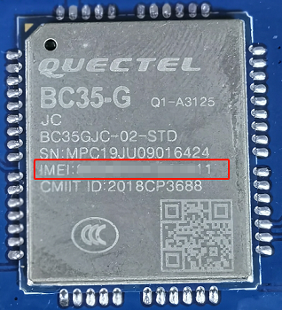
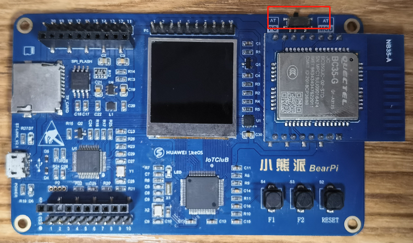
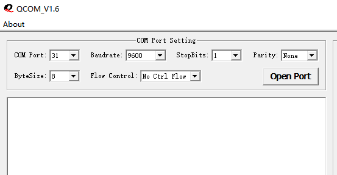
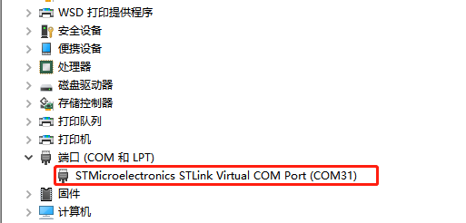
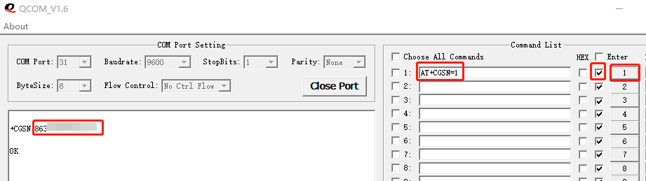

# 如何获取NB-IoT设备的IMEI号

## 1. 直接从模块上读取
<table><tbody><tr><td></td></tr></tbody></table>

## 2. 通过AT指令获取
- 下载串口工具QCOM

    链接：https://pan.baidu.com/s/1_EWhwi-y5egI-mKJQafeAw?pwd=1234 
    提取码：1234

- 连接设备

    将开发板右上脚的开关拨到AT-PC模式，并使用USB线将开发板与电脑连接。

    <table><tbody><tr><td></td></tr></tbody></table>

- 设置COM信息

    <table><tbody><tr><td></td></tr></tbody></table>

    COM Port设置为设备管理器里查看到的映射端口，波特率为9600，其他默认设置。

    <table><tbody><tr><td></td></tr></tbody></table>

- 发送指令查询

    在右边列表中输入“AT+CGSN=1”,并勾选回车换行，然后点击指令后面的数字，即可查询到设备的IMEI号。

    <table><tbody><tr><td></td></tr></tbody></table>

# 注：查询完IMEI后请将串口开关拨回AT+MCU模式
