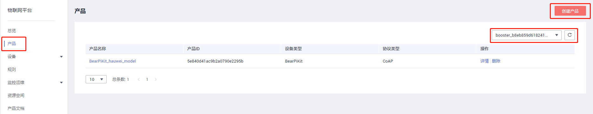
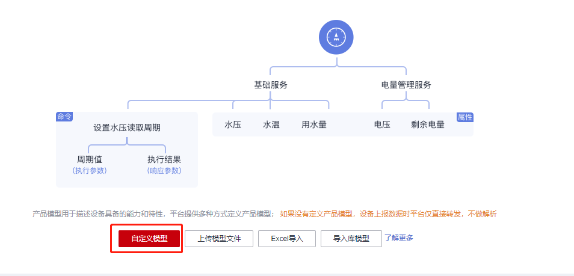
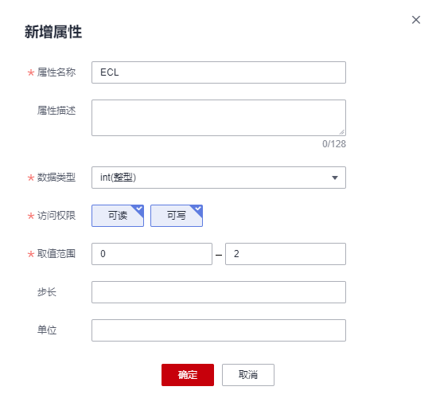

# 基于NB-IoT的智慧路灯案例

## 1. 基于NB-IoT的智慧路灯案例概述

本文档将介绍如何使用BearPi-IoT_Std的完成基于NB-IoT的智慧路灯实验。

## 2. 实验准备
- 开发板：小熊派开发板（含NB卡、NB35-A/NB28-A通信扩展板、E53_SC1案例扩展板等）
- IoT平台：华为云账号（需完成实名认证）
## 3. 硬件连接
连接好E53_SC1案例扩展板和NB35-A/NB28-A通信扩展板，NB35-A/NB28-A通信扩展板需要安装SIM卡，并注意卡的缺口朝外插入。将**串口选择开关拨到MCU模式**，并用USB线将开发板与电脑连接，如下图所示。

<table><tbody><tr><td></td></tr></tbody></table>

## 4. 创建产品

某一类具有相同能力或特征的设备的集合称为一款产品。除了设备实体，产品还包含 该类设备在物联网能力建设中产生的产品信息、产品模型（Profile）、插件、测试报告 等资源。

- 使用华为云账号，登录[设备接入](https://console.huaweicloud.com/iotdm/?region=cn-north-4#/dm-portal/home)，选择页面左侧的产品，单击右上角下拉框，选择新建产品所属的资源空间。

    <table><tbody><tr><td></td></tr></tbody></table>

- 单击右上角的“创建产品”，创建一个基于LwM2M/CoAP协议的产品，填写参数后，单击“立即创建”，在跳出页面中点击“查看详情”。

    <table><tbody><tr><td></td></tr></tbody></table>

## 5. Profile定义
- 在“功能定义”页面下，单击“自定义模型”，配置产品的服务。

    <table><tbody><tr><td></td></tr></tbody></table>

### 5.1 新增服务名称Button

- 填写Button服务相关信息后，单击“确认”。

    <table><tbody><tr><td></td></tr></tbody></table>

- 在“Button”的列表下点击“添加属性”填写相关信息，单击“确认”。

    <table><tbody><tr><td></td></tr></tbody></table>

### 5.2 新增服务名称LED

- 在“模型定义”下点击“添加服务”填写相关信息，单击“确认”。

    <table><tbody><tr><td></td></tr></tbody></table>

    <table><tbody><tr><td></td></tr></tbody></table>

- 在“LED”的列表下点击“添加命令”填写相关信息

    <table><tbody><tr><td></td></tr></tbody></table>

- 在“新增命令”里点击“新增输入参数”填写相关信息，再单击“确定”。
    <table><tbody><tr><td></td></tr></tbody></table>

- 在“新增命令”里点击“新增响应参数”填写相关信息，再单击“确认”，最后在“新增命令”里点“确认”。

    <table><tbody><tr><td></td></tr></tbody></table>

### 5.3 新增服务名称Sensor
- 在“功能定义”下点击“添加服务”填写相关信息，单击“确认”。

    <table><tbody><tr><td></td></tr></tbody></table>

- 在“Sensor”的列表下点击“添加属性”填写相关信息，单击“确认”。

    <table><tbody><tr><td></td></tr></tbody></table>

### 5.3 新增服务名称Connectivity

- 在“功能定义”下点击“添加服务”填写相关信息，单击“确认”。

    <table><tbody><tr><td></td></tr></tbody></table>

- 在“Sensor”的列表下点击“添加属性”填写相关信息：SignalPower，
ECL，SNR，CellID，单击“确认”。

   <table><tbody><tr><td></td></tr></tbody></table>

   <table><tbody><tr><td></td></tr></tbody></table>

   <table><tbody><tr><td></td></tr></tbody></table>

   <table><tbody><tr><td></td></tr></tbody></table>

## 6. 编解码插件开发 
### 6.1 新增消息Report_Connectivity。
- 在产品详情插件开发页面，选择“图形化开发”，单击“图形化开发”。

   <table><tbody><tr><td></td></tr></tbody></table>

- 在“在线开发插件”区域，单击“新增消息”。

   <table><tbody><tr><td></td></tr></tbody></table>

- 新增消息：

    消息名：Report_Connectivity
    
    消息类型：数据上报
    
    添加响应字段：是
    
    响应数据：AAAA0000（默认）
    
    <table><tbody><tr><td></td></tr></tbody></table>

- 在“新增消息”界面，单击“添加字段”。
- 在“添加字段”界面，勾选“标记为地址域”，然后单击“确认”，添加地址域字段messageId。

    <table><tbody><tr><td></td></tr></tbody></table>

- 在“新增消息”界面，单击“添加字段”，填写SignalPower相关信息，然后单击“确认”。

    <table><tbody><tr><td></td></tr></tbody></table>

- 在“新增消息”界面，单击“添加字段”，填写ECL相关信息，然后单击“确认”。

    <table><tbody><tr><td></td></tr></tbody></table>

- 在“新增消息”界面，单击“添加字段”，填写SNR相关信息，然后单击“确认”。

    <table><tbody><tr><td></td></tr></tbody></table>

- 在“新增消息”界面，单击“添加字段”，填写CellID相关信息，然后单击“确认”。

    <table><tbody><tr><td></td></tr></tbody></table>

- 在“新增消息”界面，单击“确认”，完成消息Report_Connectivity的配置。


### 6.2 新增消息Report_Toggle。

- 新增消息：

    消息名：Report_Toggle
    
    消息类型：数据上报
    
    添加响应字段：是
    
    响应数据：AAAA0000（默认）
    
    <table><tbody><tr><td></td></tr></tbody></table>

- 在“新增消息”界面，单击“添加字段”。
- 在“添加字段”界面，勾选“标记为地址域”，然后单击“确认”，添加地址域字段messageId。

    <table><tbody><tr><td></td></tr></tbody></table>

- 在“新增消息”界面，单击“添加字段”，填写toggle相关信息，然后单击“确认”。

    <table><tbody><tr><td></td></tr></tbody></table>
- 在“新增消息”界面，单击“确认”，完成消息Report_Toggle的配置。

### 6.3 新增消息Report_Sensor。

- 新增消息：

    消息名：Report_Sensor
    
    消息类型：数据上报
    
    添加响应字段：是
    
    响应数据：AAAA0000（默认）
    
    <table><tbody><tr><td></td></tr></tbody></table>

- 在“新增消息”界面，单击“添加字段”。
- 在“添加字段”界面，勾选“标记为地址域”，然后单击“确认”，添加地址域字段messageId。

    <table><tbody><tr><td></td></tr></tbody></table>

- 在“新增消息”界面，单击“添加字段”，填写data相关信息，然后单击“确认”。

    <table><tbody><tr><td></td></tr></tbody></table>

- 在“新增消息”界面，单击“确认”，完成消息Report_Sensor的配置。

### 6.4 新增消息Set_Led。

- 新增消息：

    消息名：Set_Led
    
    消息类型：命令下发
    
    添加响应字段：是
    
    
    <table><tbody><tr><td></td></tr></tbody></table>

- 在“新增消息”界面，单击“添加字段”， 在“添加字段”界面，勾选“标记为地址域”，然后单击“确认”，添加地址域字段messageId。

    <table><tbody><tr><td></td></tr></tbody></table>

- 在“新增消息”界面，单击“添加字段”，在“添加字段”界面，勾选“标记为 响应标识字段”，然后单击“确认”，添加响应标识字段 mid。

    <table><tbody><tr><td></td></tr></tbody></table>

- 在“新增消息”界面，单击“添加字段”，填写led相关信息，然后单击“完成”。

    <table><tbody><tr><td></td></tr></tbody></table>

- 在“新增消息”界面，单击“添加响应字段” 
- 在“添加字段”界面，勾选“标记为地址域”，然后单击“确认”，添加地址域字段 messageId。
- 在“添加字段”界面，勾选“标记为响应标识字段”，然后单击“确认”，添加响应标识字段 mid。 
- 在“添加字段”界面，勾选“标记为命令执行状态字段”，然后单击“确认”，添加命令执行状态字段 errcode。

    <table><tbody><tr><td></td></tr></tbody></table>

- 在“新增消息”界面，单击“添加响应字段”，填写light_state相关信息，单击“确认”。

    <table><tbody><tr><td></td></tr></tbody></table>

- 在“新增消息”界面，单击“确认”，完成消息 Set_Led 的配置。
### 6.5 字段映射
- 拖动右侧“产品模型”区域的属性字段、命令字段和响应字段，与数据上报消息、命令下发消息和命令响应消息的相应字段建立映射关系。


    <table><tbody><tr><td></td></tr></tbody></table>

    <table><tbody><tr><td></td></tr></tbody></table>

    <table><tbody><tr><td></td></tr></tbody></table>

    <table><tbody><tr><td></td></tr></tbody></table>

- 单击“保存”，并在插件保存成功后单击“部署”，将编解码插件部署到物联网平台

    <table><tbody><tr><td></td></tr></tbody></table>

## 7. 设备开发
### 7.1 程序编译

1. 进入编译目录

```
cd targets/STM32L431_BearPi
```
2. 拷贝工程配置

```
cp Demos/oc_nb_lwm2m_light/defaults.sdkconfig .config
```
3. 生成config.h

```
start genconfig.exe
```
4. 编译工程

```
make -j8
```

### 7.2 烧录程序

1. 在编译目录下输入

    ```
    make download
    ```
    <table><tbody><tr><td></td></tr></tbody></table>

## 8. 业务调试

1. 注册设备

    - 点击华为云IoT平台页面左侧的“设备”→“所有设备”，点击右上角“注册设备”。

    <table><tbody><tr><td></td></tr></tbody></table>

    - 选择所属资源空间及产品，填写NB-IoT设备的IMEI号，点击“确定”。（[如何获取NB-IoT设备的IMEI号](../../../../docs/device-dev/如何获取NB-IoT设备的IMEI号.md)）

    <table><tbody><tr><td></td></tr></tbody></table>

2. 示例代码编译烧录代码后，按下开发板的RESET按键，可通过串口助手查看日志，平台上的设备显示为在线状态。

    <table><tbody><tr><td></td></tr></tbody></table>

3. 点击设备右侧的“查看”，进入设备详情页面，可看到上报的数据。

4. 在华为云平台设备详情页，单击“命令”，选择**异步命令下发**，选中创建的命令属性，单击“确定”，即可发送下发命令控制设备。