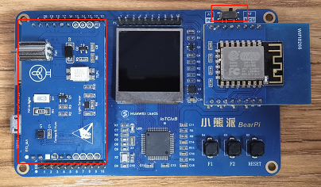
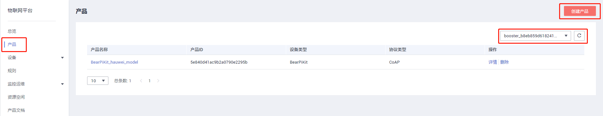
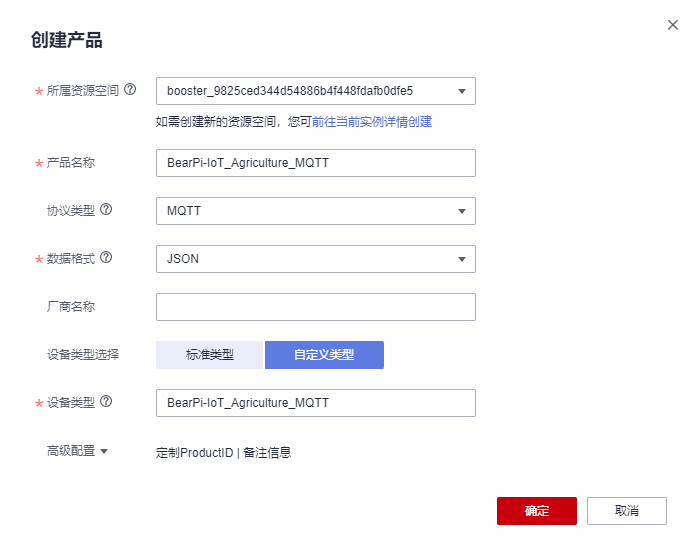
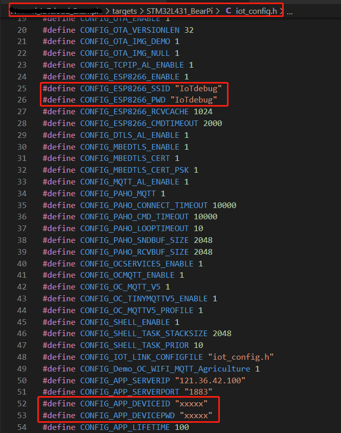
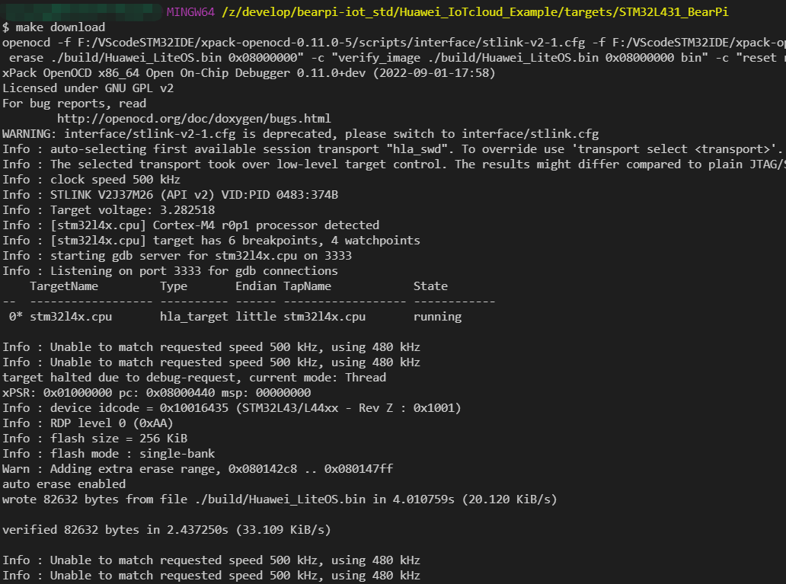
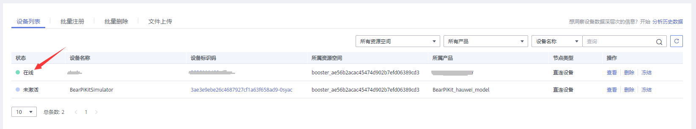

# 基于WiFi MQTT协议的智慧农业案例

## 1. 基于WiFi MQTT协议的智慧农业案例概述

本文档将介绍如何使用BearPi-IoT_Std的完成基于WiFi MQTT协议的智慧农业实验。

## 2. 实验准备
- 开发板：小熊派开发板（WIFI8266通信扩展板、E53_IA1案例扩展板等）
- IoT平台：华为云账号（需完成实名认证）
## 3. 硬件连接
连接好E53_IA1案例扩展板和WIFI8266通信扩展板，将**串口选择开关拨到MCU模式**，并用USB线将开发板与电脑连接，如下图所示。

<table><tbody><tr><td></td></tr></tbody></table>

## 4. 创建产品

某一类具有相同能力或特征的设备的集合称为一款产品。除了设备实体，产品还包含 该类设备在物联网能力建设中产生的产品信息、产品模型（Profile）、插件、测试报告 等资源。

- 使用华为云账号，登录[设备接入](https://console.huaweicloud.com/iotdm/?region=cn-north-4#/dm-portal/home)，选择页面左侧的产品，单击右上角下拉框，选择新建产品所属的资源空间。

    <table><tbody><tr><td></td></tr></tbody></table>

- 单击右上角的“创建产品”，创建一个基于MQTT协议的产品，填写参数后，单击“立即创建”，在跳出页面中点击“查看详情”。

    <table><tbody><tr><td></td></tr></tbody></table>

## 5. Profile定义
- 单击产品详情页的自定义模型，在弹出页面中新增服务，如下图所示。

    服务ID：`Agriculture`(必须一致)

    服务类型：`Sensor`(可自定义)
    <table><tbody><tr><td></td></tr></tbody></table>

- 在“Agriculture”的下拉菜单下点击“添加属性”填写相关信息“Temperature”，
“Humidity”，“Luminance”，“LightStatus”，“MotorStatus”，如下图所示。


    <table><tbody><tr><td></td></tr></tbody></table>

    <table><tbody><tr><td></td></tr></tbody></table>

    <table><tbody><tr><td></td></tr></tbody></table>

    <table><tbody><tr><td></td></tr></tbody></table>

    <table><tbody><tr><td></td></tr></tbody></table>

- 在“Agriculture”的下拉菜单下点击“添加命令”填写相关信息。

    命令名称：`Agriculture_Control_light`

    参数名称：`Light`

    数据类型：`string`

    长度：`3`

    枚举值：`ON,OFF`

    <table><tbody><tr><td></td></tr></tbody></table>

    命令名称：`Agriculture_Control_Motor`

    参数名称：`Motor`

    数据类型：`string`

    长度：`3`

    枚举值：`ON,OFF`

    <table><tbody><tr><td></td></tr></tbody></table>

## 6. 注册设备

- 在侧边栏中单击“设备”，进入设备页面，单击右上角“注册设备”，勾选对应所属资源空间并选中刚刚创建的产品，注意设备认证类型选择“秘钥”，按要求填写秘钥，如下图所示。

<table><tbody><tr><td></td></tr></tbody></table>

- 记录下设备ID和设备密钥，如下图所示。
<table><tbody><tr><td></td></tr></tbody></table>

- 注册完成后，在设备页面单击“所有设备”，即可看到新建的设备，同时设备处于未激活状态，如下图所示。

<table><tbody><tr><td></td></tr></tbody></table>

## 7. 设备开发
### 7.1 程序编译

1. 进入编译目录

```
cd targets/STM32L431_BearPi
```
2. 拷贝工程配置

```
cp Demos/oc_wifi_mqtt_agriculture/defaults.sdkconfig .config
```
3. 生成iot_config.h

    ```
    start genconfig.exe
    ```
4. 修targets/STM32L431_BearPi/iot_config.h

    - 将iot_config.h中的CONFIG_ESP8266_SSID、CONFIG_ESP8266_PWD修改为所要连接的wifi热点的账号密码；
    - 将CONFIG_APP_DEVICEID 、CONFIG_APP_DEVICEPWD修改为前面注册设备时候生成的“设备ID”和设备密钥。

        <table><tbody><tr><td></td></tr></tbody></table>

5. 编译工程

    ```
    make clean
    make -j8
    ```

### 7.2 烧录程序

1. 在编译目录下输入

    ```
    make download
    ```
    <table><tbody><tr><td></td></tr></tbody></table>

## 8. 业务调试

1.  示例代码编译烧录代码后，按下开发板的RESET按键，可通过串口助手查看日志，平台上的设备显示为在线状态。

    <table><tbody><tr><td></td></tr></tbody></table>

2. 点击设备右侧的“查看”，进入设备详情页面，可看到上报的数据。

3. 在华为云平台设备详情页，单击“命令”，选择**同步命令下发**，选中创建的命令属性，单击“确定”，即可发送下发命令控制设备。